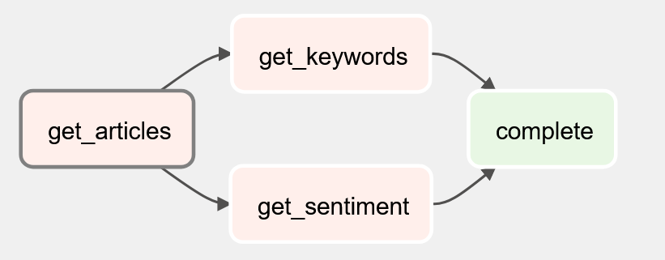

# OpenAI Sentiment Analysis Pipeline
## my demo

### The goal of this pipeline is to ingest political articles from [newsapi](https://newsapi.org) and to utilize [openai](https://openai.com) `text-davinci-003` model to gain some insights like headline keywords and sentiment value.

# Setup
* AWS Postgres infrastructure via terraform
    * create a `./infrastructure/secrets.tfvars` to set a postgres password (see `./infrastructure/secrets.tfvars.template`)
    * the terraform script assumes default aws profile on system
    * Remove all files or folders from `./infrastructure` if running from scrach except
        * `main.tf`
        * `Makefile`
        * `outputs.tf`
        * `secrets.tfvars`
        * `variables.tf`
    * run `terraform init`
    * use make commands to run setup
        * `make plan`
        * `make deploy`
    * to tear down infrastructure
        * `make destroy`
* Create db
    * use a SQL tool like dbeaver to create the schema in `./sql/schema.sql`
* Initialize Airflow
    * create a `.env` to set airflow and AWS environmental values (follow `./.env.template`)
    * run `docker-compose up airflow-init`
    * run `docker-compose up`
* Airflow Variables
    * create `news_key` variable to store your [newsapi](https://newsapi.org) API key
    * create `openai_key` variable to store your [openai](https://openai.com) API key
    * create `news_sources` variable to store a json list of news sources (see [newsapi](https://newsapi.org) for a list of news sources)
* Airflow Connections
    * create a postgres connection called `freightwaves_rds`
    * host - would be the host created from running terraform, see AWS RDS via the AWS console
    * schema - `postgres`
    * username - `freightwaves`
    * password - The password in the `./infrastructure/secrets.tfvars` file

## Database
* `./sql/schema.sql` shows the three tables that are created and used
    * `articles` which contains the title, source and url
    * `keyword` which contains the keywords for each article (1 to many relationship with `articles`)
    * `sentiment_values` which contains the sentiment values (0 to 100) for each article (1 to 1 relationship with `articles`)

## Airflow Dag
* `./dags/sentiment_demo.py`
    * `get_articles` task gets the articles and persists into `sentiment.articles`
    * `get_keywords` task uses the article titles to prompt openai's model for the keywords and the results are persisted in `sentiment.keyword`
    * `get_sentiment` task uses the article titles to prompt openai's model for the sentiment value and the results are persisted in `sentiment.sentiment_values`
    * `complete` is a dummy task indicating completion of the dag run
    * the `get_articles` and `get_keywords` tasks run in parallel as they are independent of each other

